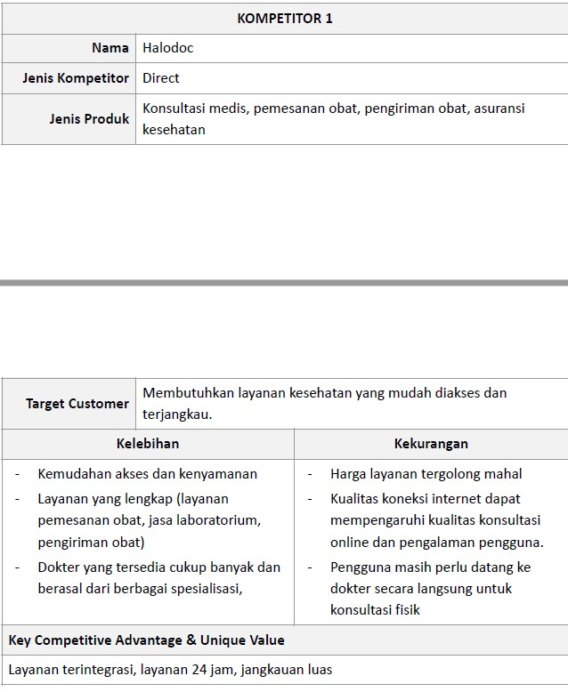
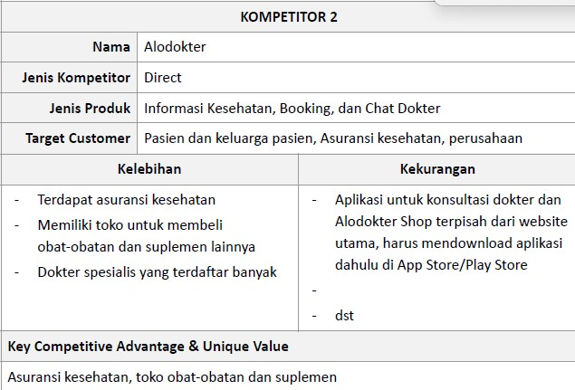
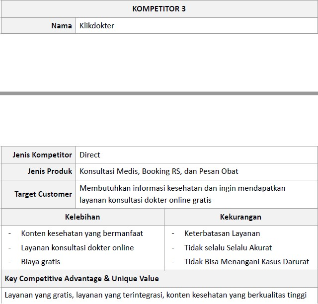
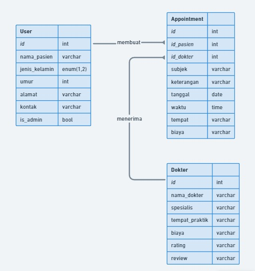
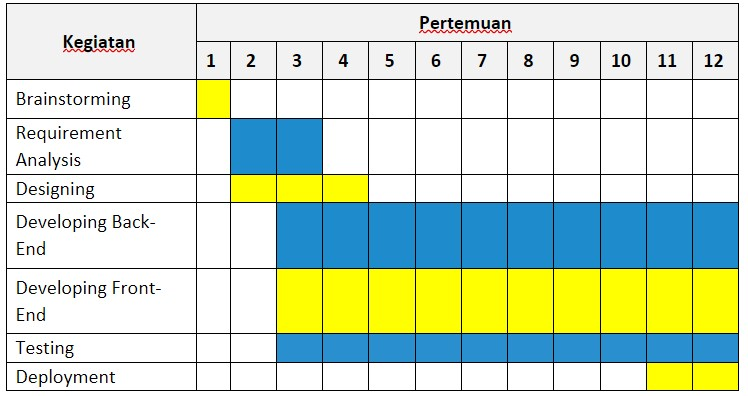

<h1> Kelompok docdoc </h1> 

- Ketua Kelompok : Nindya Fathul Risya - 20/460556/TK/51145

- Anggota 1 : Siti Malatania - 20/456380/TK/50510

- Anggota 2 : Luthfi Izzuddin Hanif - 20/463605/TK/51597

<h3> Project Senior Project TI </h3>

Departemen Teknologi Elektro dan Teknologi Informasi, Fakultas Teknik, Universitas Gadjah Mada

<h2> Modul 1 </h2>
<h3> Tentang Aplikasi </h3>

 - Nama aplikasi: doctorify 

 - Jenis produk: layanan kesehatan

<h3> Latar Belakang Masalah </h3>

 Peningkatan penggunaan teknologi mobile, seperti smartphone dan tablet serta
perubahan perilaku pengguna dalam mencari informasi dan layanan telah mendorong
munculnya inovasi dalam bidang teknologi kesehatan, termasuk pelayanan kesehatan.
Pelayanan kesehatan yang baik dan berkualitas merupakan hak setiap orang. Dalam
pelayanan kesehatan berkaitan dengan aksesibilitas pelayanan kesehatan. Aksesibilitas
pelayanan kesehatan adalah kemampuan seseorang untuk mendapatkan pelayanan
kesehatan yang dibutuhkan tanpa terhambat oleh faktor ekonomi, sosial, geografis, atau
budaya. Aplikasi ini dapat membantu meningkatkan aksesibilitas pelayanan kesehatan
dengan memungkinkan pengguna untuk mencari dan memesan janji temu dengan
mudah dan nyaman tanpa harus datang ke klinik atau rumah sakit. 

<h3> Permasalahan </h3>

 - Bagaimana cara membuat appointment dengan dokter yang diinginkan?

 - Bagaimana memastikan jadwal yang dibuat dengan dokter tidak bertabrakan
dengan pasien lain?

 - Bagaimana membuat sistem penilaian dan review dokter yang dapat membantu
pasien memilih dokter sesuai dengan kebutuhannya?

 - Bagaimana cara mengumpulkan dan menampilkan informasi review dokter
dengan akurat dan terpercaya?

<h3> Ide Solusi </h3>

 Aplikasi ini dapat membantu pasien membuat appointment dengan dokter yang dipilih
sendiri oleh pasien. Pasien dapat memilih untuk bertemu langsung dengan dokter di
rumah sakit yang dipilih atau melalui fitur chat dengan dokter.

<h3> Analisis dan Referensi Kompetitor </h3>

<h3> Tujuan produk </h3>

 Tujuan dari produk kami yaitu doctorify yaitu dapat membantu meningkatkan aksesibilitas pelayanan kesehatan dengan memungkinkan pengguna untuk mencari dan memesan janji temu dengan mudah dan nyaman tanpa harus datang ke klinik atau rumah sakit. 

<h3> Pengguna potensial </h3>

 Pengguna potensial dari produk kami adalah 

Pasien yang sibuk: pengguna ini memiliki jadwal yang sibuk mungkin tidak memiliki waktu untuk menelepon atau datang ke klinik atau rumah sakit untuk membuat janji temu dokter, sehingga mereka membutuhkan produk yang dapat membuat janji temu kapan saja dan di mana saja. 

Pasien dengan mobilitas terbatas : pengguna ini memiliki mobilitas terbatas untuk bertemu dengan dokter secara langsung, maka dari itu mereka membutuhkan sebuah produk yang memungkinkan mereka untuk bertemu dengan dokter secara langsung 

Pasien yang mencari kenyamanan: pengguna ini mencari kenyamanan dalam Mereka ingin dengan mudah memilih dokter yang mereka inginkan, meninjau jadwal dan ulasan sebelum membuat janji temu, dan bahkan melakukan pembayaran online. 

<h3> Use case diagram </h3>

<h3> Functional Requirements </h3>

 Signup : User dapat mendaftar untuk menggunakan layanan ini 

Login : User dapat melakukan login sebagai pasien atau sebagai dokter 

Memilih dokter spesialis untuk membuat janji : Pasien memilih dokter yang diinginkan sesuai dengan keluhan yang dialami 

Memilih Jadwal dokter yang tersedia : Pasien dapat memilih jadwal yang tersedia dari dokter yang dipilih 

Memberi review dokter setelah konsultas : Pasien memberikan review untuk dokter setelah sesi konsultasi selesai 

Menerima atau menolak janji dengan dokter : Dokter dapat menolak atau menerima janji yang dibuat oleh pasien 

Memberitahu janji yang dibuat pasien : Admin memberi tahu jadwal janji yang telah dibuat oleh pasien kepada dokter 

Memberitahu jadwal yang tersedia : Dokter memberi tahu jadwal yang dokter yang tersedia kepada admin 

<h3> ERD </h3>

<h3> Low fidelity wireframe </h3>

<h3> Gantt Chart </h3>

